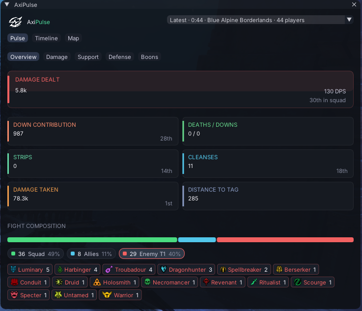
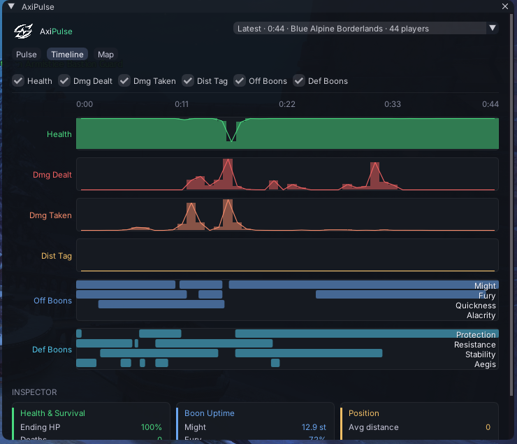
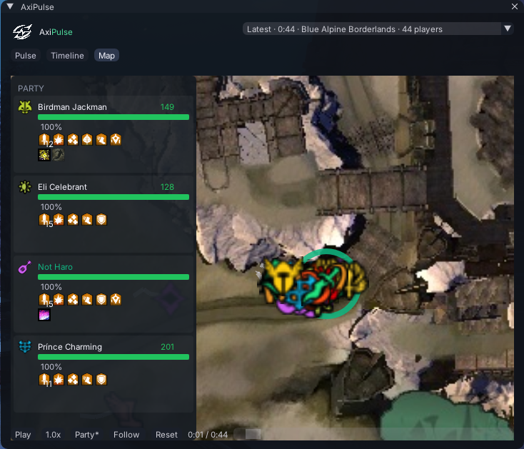
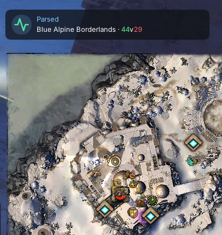

# arcdps_axipulse

A Rust ArcDPS plugin that runs the bundled Elite Insights CLI against each
.evtc your client writes, parses the JSON output, and renders WvW combat
overlays in-game.

## Features

### Pulse tab — fight summary

Overview, Damage, Support, Defense, and Boons sub-tabs roll the latest
fight up into squad-relative stats: DPS and squad rank, down
contribution, strips, cleanses, damage taken, distance to tag, plus a
breakdown of squad / allied / enemy composition by profession.



### Timeline tab — per-fight tracks

Time-aligned tracks for health, damage dealt / taken, distance to tag,
and offensive / defensive boons. The inspector at the bottom drills into
the highlighted player's survival, boon uptime, and average position.



### Map tab — WvW combat replay

Top-down replay on the matching WvW map:
- Tile background sourced from official GW2 tiles (pre-cached on disk)
- Landmark pins (keeps, towers, camps, ruins)
- Each squad member's position with profession icon
- Time playback: scrubber, play/pause, speed (0.5×–2×), motion trails
- Per-player state overlays: skull (dead) / down-pin markers on the map; sliding party panel with HP bars, distance-to-commander, boon stacks, and recent skill casts
- Camera: mouse-wheel zoom (cursor-anchored), left-click drag to pan, Reset button, Follow toggle to keep your dot centred, auto-zoom + centre on the squad when a fight opens



### Notifier toast

A small toast appears on each new log with the WvW map name and
coloured ally/enemy counts, so you can confirm logs are landing without
keeping the main AxiPulse window open.



### Parser

- Bundles the Elite Insights CLI + .NET 8 runtime — no separate install
- Parser thread and EI subprocess run at below-normal priority so the
  cold-start doesn't cost you a frame at parse-start

## Install (manual)

1. Download `arcdps_axipulse.dll` from the [latest release](https://github.com/darkharasho/arcdps-axipulse/releases/latest)
2. Drop it into your GW2 ArcDPS addons folder, alongside `arcdps.dll`:
   - Steam: `…/Guild Wars 2/addons/arcdps/arcdps_axipulse.dll`
   - Standalone: `<GW2 install>/addons/arcdps/arcdps_axipulse.dll`
3. Launch GW2. Confirm by opening the ArcDPS options window — an
   **AxiPulse** entry should appear.

The WvW Map tab needs the GW2 map tiles (~25 MB). The plugin
auto-downloads them in the background on first run, into
`<addons>/axipulse-assets/tiles/`. The Map tab shows a progress strip
while the cache warms; once complete, the tiles are reused for all
future sessions.

The rest of the plugin (Pulse / Timeline / Notifier) works while the
tiles are still downloading — only the Map tab background needs them.

To uninstall, delete `arcdps_axipulse.dll` (and the `axipulse-assets/`
folder, if you grabbed it) and restart GW2.

## Build from source

Target is `x86_64-pc-windows-msvc`. From Linux, cross-compile via
`cargo-xwin`:

```
./scripts/fetch_ei.sh        # one-time: pull GW2EICLI.zip into vendor/
./scripts/fetch_tiles.sh     # one-time: populate src/assets/tiles/ (~25 MB)
cargo dll                    # release MSVC build
./scripts/deploy.sh          # atomic install into addons/arcdps/
```

Set `AXIPULSE_DEPLOY_DEST` to point `deploy.sh` at a non-default install.

Verify the build by fighting in WvW and checking `arcdps.log` for
`axipulse: parsed …` lines.
